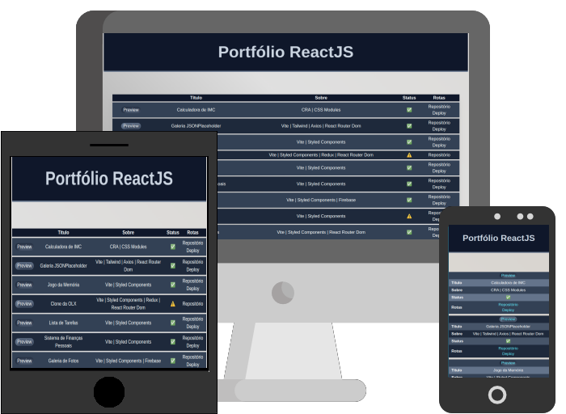

<h1 align="center">Portfólio ReactJS</h1>

  
  

<h2>:rocket: Tecnologias Usadas</h2>

  
  
  

<h2>:floppy_disk: Instalação</h2>

<code>npm install</code>

<h2>:dvd: Iniciar</h2>

<code>npm run dev</code>

<h2>:computer: Projeto</h2>

Uma tabela dinamica e responsiva que serve como vitríne para os princípais projetos desenvolvidos com ReactJS. 

<h2>:eyes: Implantação</h2>

Veja o projeto em [GitHub Pages](https://caiquedv.github.io/portfolio-reactjs).  
Mais projetos com outras tecnologia [aqui](https://caiquedv.github.io/).

